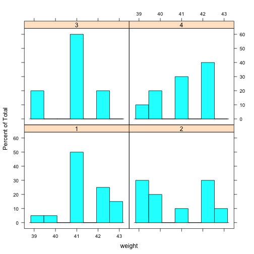
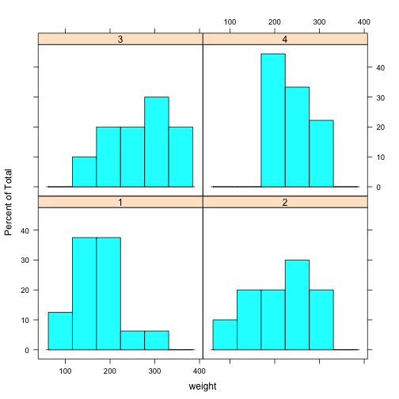

Impact of diet on chick weight over time
========================================================
author: Ben Turner
date: 4/23/15

Overview
========================================================

- Everyone knows that diet is an important determinant of weight.

- However, no one knows whether this is true for chicks as well, nor how it depends on time!

- Here, we see a glimpse of this phenomenon.

- However, the full app is needed to really answer this important question.

Current dataset
========================================================

Using the ChickWeight dataset available in the datasets library, I'm shedding light on this important problem. See the summary below:


```
     weight           Time           Chick     Diet   
 Min.   : 35.0   Min.   : 0.00   13     : 12   1:220  
 1st Qu.: 63.0   1st Qu.: 4.00   9      : 12   2:120  
 Median :103.0   Median :10.00   20     : 12   3:120  
 Mean   :121.8   Mean   :10.72   10     : 12   4:118  
 3rd Qu.:163.8   3rd Qu.:16.00   17     : 12          
 Max.   :373.0   Max.   :21.00   19     : 12          
                                 (Other):506          
```

Detail on dataset
========================================================

The number of chicks in this dataset is:

```
[1] 50
```

These chicks are divided into the following number of diet groups:

```
[1] 4
```

And measured on the following number of timepoints:

```
[1] 12
```

Does diet have an impact over time?
========================================================

Here is where the groups started:

 
***
And here is where they ended up:

 
